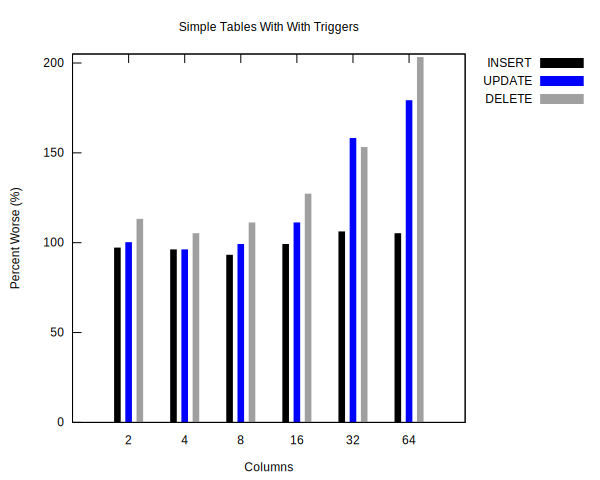
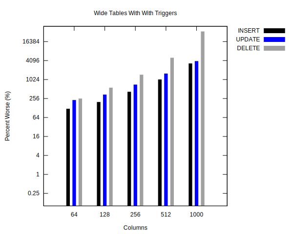
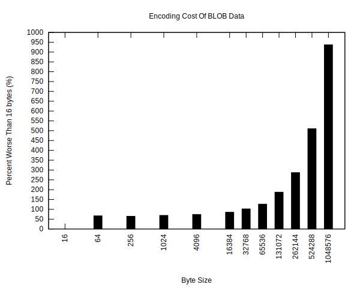

# SQLite-CDC

**A change-data-capture engine for SQLite.**

## Overview

This project implements change-data-capture, or CDC, for SQLite databases. The
current implementation works by installing triggers on target tables that record
the before and after states of a row modification to a change log table. The
engine then watches the SQLite files for changes, reads batches of change
records, and then sends them to a configurable destination for processing.

Each entry in the log contains the following information:

- Timestamp of change
- Type of change (INSERT, UPDATE, or DELETE)
- Name of source table
- Before (when type is UPDATE or DELETE)
- After (when type is INSERT or UPDATE)

The before and after fields contain the values of all columns from the source
table before and after the row was modified.

The engine can read up to a configurable number of records as a batch and
deliver these changes to some processing logic or destination. These change
records can then be used to build higher level replication systems such as
read-only replicas of SQLite data in a networked database such as MySQL,
client-side caches of data with automated invalidation, real-time ETL and data
warehousing, or even more advanced systems such as bidirectional replication
between independent databases.

## Project Status

Consider this project in alpha or a work-in-progress state.

My original plan was to put this in production by the end of 2024 but I've
missed that goal. As of writing, I've only tested the project on small scale,
non-production workloads. I've also added some benchmarks to help set
expectations or estimates around performance impacts but they aren't guaranteed
to be accurate for production workloads. Use at your own risk.

If you end up doing your own testing or experimentation with this project then
please let me know your results. I'd be grateful for any success or failure you
can share.

## Adding CDC To A Database

The included `cmd/sqlite-cdc-setup` command can be used to add or remove CDC
support from a database. This command attaches triggers to a target set of
tables that automatically populate a change log table named `__cdc_log` by
default.

```bash
go run cmd/sqlite-cdc-setup/main.go --db test.sqlite --table my_table --setup
go run cmd/sqlite-cdc-setup/main.go --db test.sqlite --table my_table --teardown
```

Use the `--help` flag to get a summary of the options. For convenience:
```
Usage of sqlite-cdc-setup:
  -blobs
        Enable support for blobs
  -db string
        SQLite file path
  -db-params string
        SQLite connection parameters. See <https://pkg.go.dev/modernc.org/sqlite#Driver.Open> for parameter syntax (default "_pragma=journal_mode(wal)&_pragma=busy_timeout(5000)")
  -disable-subsec
        Disable subsecond time resolution to support old clients
  -log-table string
        Name of the table to store CDC log entries (default "__cdc_log")
  -setup
        Perform initial setup of the database for CDC before starting in any mode
  -table value
        A table name to monitor. Can be specified multiple times
  -teardown
        Perform teardown of the CDC tables and triggers. Setting the teardown flag prevents any other action. The process will perform the teardown and then exit
  -version
        Print version and exit
```

### Running The Example Processor

The easiest way to test the changelog table and process the contents is to use
the `cmd/sqlite-cdc` command. To see CDC events streamed to the console use
something like:

```bash
go run cmd/sqlite-cdc/main.go --output json --db test.sqlite --table my_table --bootstrap --cdc
```

This will begin streaming JSON encoded change events to the console starting
with an event for every existing row followed by events from the changelog
table:

```json
{
    "table":"my_table",
    "timestamp":"2024-05-05T19:03:11.5681173-05:00",
    "operation":"INSERT",
    "before":null,
    "after":{"email":"noreply@example.com","favorite_color":"blue","id":1,"username":"example"}
}

{
    "table":"my_table",
    "timestamp":"2024-05-06T00:03:34Z",
    "operation":"UPDATE",
    "before":{"email":"noreply@example.com","favorite_color":"blue","id":1,"username":"example"},
    "after":{"email":"noreply@example.com","favorite_color":"green","id":1,"username":"example"}
}

{
    "table":"my_table",
    "timestamp":"2024-05-06T00:04:07Z",
    "operation":"DELETE",
    "before":{"email":"noreply@example.com","favorite_color":"green","id":1,"username":"example"},
    "after":null
}
```

Use the `--help` flag to see all the available options. Here's a snapshot of
what's available:
```
Usage of sqlite-cdc:
  -batch-size int
        The max number of log entries to collect in each batch (default 256)
  -blobs
        Enable support for blobs
  -bootstrap
        Read all existing records as if they are inserts and then exit. If this flag is set in addition to the cdc flag the cdc mode will begin after the bootstrap is complete
  -cdc
        Run a continuous extraction of the CDC log.
  -db string
        SQLite file path
  -db-params string
        SQLite connection parameters. See <https://pkg.go.dev/modernc.org/sqlite#Driver.Open> for parameter syntax (default "_pragma=journal_mode(wal)&_pragma=busy_timeout(5000)")
  -disable-subsec
        Disable subsecond time resolution to support old clients
  -log-table string
        Name of the table to store CDC log entries (default "__cdc_log")
  -output string
        Write destination for log entries. Valid options are - for simplified stdout, json for full JSON stdout, or an HTTP URL that will receive POST requests containing batches of log entries. See <pkg.go.dev/github.com/kevinconway/sqlite-cdc/handlers#HTTP> for more. (default "-")
  -table value
        A table name to monitor. Can be specified multiple times
  -version
        Print version and exit
```

### Limits Of The Provided Processor

The example processor exists primarily for demonstrations and for quickly
performing an initial test of the system. In most cases, I expect that you will
use the example as a template for creating your own custom build that integrates
your own event handling logic and better integrates with your runtime
environment by, for example, adding instrumentation.

As is, the example processor can perform all the CDC responsibilities but
supports only three outputs:

- Simplified logging to STDOUT (ex: `<timestamp>: <table> <operation>`)
- JSON logging to STDOUT (shown in the previous section)
- HTTP POST

If you absolutely must use the example as-is then the HTTP POST output enables
you to redirect batches of CDC events to a specified URL. That receiver can then
implement any logic you need. Note that the current version of the project does
not include any form of built-in retries so your POST endpoint must implement
those internally. See <https://pkg.go.dev/github.com/kevinconway/sqlite-cdc/handlers#HTTP>
for details on the API contract.

## Extending The Engine

Custom builds need to provide two components: an event handler and a database
client.

The database client can be any SQLite driver for Go that implements the standard
library `databases/sql` driver interface. See
<https://github.com/cvilsmeier/go-sqlite-bench> for benchmarks covering most of
the popular drivers available for Go.

The event handler is anything that implements:
```golang
type ChangesHandler interface {
	HandleChanges(ctx context.Context, changes Changes) error
}
```
Each call to `HandleChanges` receives a batch of change records. Each batch of
changes given to your event handler will be in change order. The engine makes
only one call to the handler at a time so that batches are also strictly
processed in change order. If the handler returns an error then the engine
considers this a critical fault and shuts down. If the handler returns success
then the entire batch is considered successful and the relevant changes are
removed from the log. Your handler is responsible for durability or reliability
behaviors such as retries with backoff.

### API Documentation

<https://pkg.go.dev/github.com/kevinconway/sqlite-cdc>

## Limitations

### BLOB Support

By default, the engine ignores all columns with a BLOB type. BLOB support can be
enabled by using the `WithBlobSupport(true)` option when constructing the engine
or the `--blobs` flag when using the example executable. However, BLOB support
is limited even when enabled.

When enabled, all values in a BLOB typed column are converted to an upper-case,
hexadecimal representation of the BLOB's value using the SQLite
[hex](https://www.sqlite.org/lang_corefunc.html#hex) function. This is done to
make the values representable in JSON because JSON has no native expression of
raw bytes.

Note, however, that SQLite distinguishes between column type and data type. By
default, column types are not enforced and SQLite is capable of storing any data
type within any column. For example, a column may be defined with type INTEGER
but that does not prevent a client from inserting values that are of type TEXT
or BLOB.

This project cannot handle BLOB type data in a non-BLOB type column. I suggest
using [STRICT tables](https://www.sqlite.org/stricttables.html) to avoid this
situation.

Note also that larger blob values take longer to convert to hex and can result
in poorer performance.

### Very Wide Tables

The engine uses SQLite functions to produce JSON representations of a record.
SQLite has a hard limit of 127 arguments per function call. This equates to a
limit of 63 columns convertible per function call.

All rows from tables with less than 64 columns are converted to JSON in a single
function call. Tables with 64 or more columns engage in an alternative
conversion process. The wide table conversion process groups columns into sets
of 63, generates a JSON object from each set, and performs a series of JSON
patches to merge each column set with the previously generated JSON object.

Wide table conversion is limited to 1000 columns because this is the default
stack depth limit for SQLite. Wider tables result in poorer performance.

### WAL Mode Required

Running `sqlite-cdc` on your database necessarily adds reads and writes that are
concurrent with your existing usage. Practically, enabling WAL mode is the only
way for this to work.

### Clients With Version Less Than 3.42.0

The log table contains a timestamp that represents the time of change. SQLite
datetime resolution is second precision by default. Version 3.42.0 added a
`subsecond` modifier to time functions that enables millisecond precision.

If any of your clients are older than 3.42.0 then you must use the
`WithoutSubsecondTime` option when constructing an engine or the
`--disable-subsec` flag in the example executable.

It's important to note that the version is associated with the client and not
the database file. It is possible to have both old and new clients operating on
the same database file. The lowest versioned client determines the limitations.

### Clients With Version Less Than 3.38.0

Any clients older than 3.38.0 must be compiled with JSON support enabled. This
is enabled by default on 3.38.0 and newer clients.

## Why Not Use The Session API?

SQLite can be built with an extension called
[session](https://sqlite.org/sessionintro.html) that provides an API for
recording database changes and formatting them into change sets. The resulting
change sets contain very similar information to the current design of the change
log that this project uses.

On the surface, the sessions extension appears to be a great fit for CDC.
Starting a session begins a capture of all changes to a select set of tables.
Each change record describes modifications to a table row. Those change records
accumulate in a log that can be fetched at any time. This is conceptually the
same as what this project does.

However, the sessions extension has three notable behaviors that make it the
wrong choice for general purpose CDC. The first is that session change records
are only materialized when reading the log and only one change is generated per
row that was modified. As a result, sessions are a poor way to receive real-time
change notifications and are only capable of producing the final state of a
record rather than a series of interim changes. The second behavior is that the
session log can only be fetched as a whole but never resets. As a result, the
session log grows unbounded and there is no mechanism to filter out already
handled changes. The third behavior is that a session is not necessarily
persisted beyond the lifetime of the database connection it's associated with.
As a result, there is no way to restore CDC from the last known position if the
system exited for any reason.

The sessions extension appears to be designed to operate in a specific kind of
environment where SQLite is being used as a data structure rather than a typical
SQL database. Sessions work best when more tightly integrated into application
logic and aren't well suited for this project's "bolt-on" or sidecar model.

## Performance Impacts Of The CDC Triggers

I don't yet have any production performance metrics to share. Until then, the
code includes benchmarks that attempt to measure the performance impacts of the
change capture triggers and the different ways they manage or encode data. The
benchmarks are run with the following pragmas:

- journal_mode(wal)
- busy_timeout(5000)
- synchronous(normal)
- foreign_keys(on)

You can run the suite of benchmarks using either standard Go tooling or the
included `make benchmarks` rule. The Makefile rule generates a set of benchmark
outputs in `.build/.bench/` that contain 20 runs of each benchmark. The `make
benchmark-reports` rule will generate a comparative analysis of the contents of
each output file as a CSV. Note that the full suite of benchmarks can take
potentially more than an hour to complete.

The results below are based on running the benchmarks on a local workstation.
The workstation was not dedicated to the benchmarks and subject to jitter. I've
included the percent differences but not the absolute values because the
absolute values will differ based on hardware but the percent differences should
be somewhat consistent across different hardware configurations. For a sense of
scale, the absolute values for individual operations without triggers, in my
test runs, were in the magnitude of 10s of microseconds.

My personal interpretation of the overall results is that the CDC triggers add
marginal write performance overhead for the majority of use cases.

### Simple Tables

The "simple" table benchmarks are run without concurrency and compare the cost
of insert, update, and delete statements. The tables used in these benchmarks
are defined with all integer columns, an integer primary key, and without ROWID.
The number of columns never exceeds 63 which is the maximum count that can be
converted to a CDC record by the triggers in a single step.

| Columns | Insert (% Difference) | Update (% Difference) | Delete (% Difference) |
| ------- | ------------- | ------------- | ------------- |
|2 | 97% | 100% | 113% |
|4 | 96% | 96% | 105% |
|8 | 93% | 99% | 111% |
|16 | 99% | 111% | 127% |
|32 | 106% | 158% | 153% |
|64 | 105% | 179% | 203% |



For most table sizes the average overhead appears to be around 100% compared to
a single operation which matches the expectations of the triggers adding an
additional insert for each modifying operation. The overhead of the JSON
encoding of the data appears minimal for small table but grows with column
count.

### Wide Tables

The wide table benchmarks are the same as the simple table benchmarks but the
tables are always larger than 63 columns. This engages a workaround for the max
SQLite function parameter limit which is 127. To generate JSON objects with more
than 63 key/value pairs the system computes objects in batches of up to 63
columns and then merges the results using the json_patch function. The
performance impacts grow relative to the number of objects that must be merged.
Here's a table and graph illustrating the performance impacts of wide tables:

| Columns | Insert (% Difference) | Update (% Difference) | Delete (% Difference) |
| ------- | ------------- | ------------- | ------------- |
| 64 |  119% | 225% | 251% |
| 128 | 195% | 335% | 556% |
| 256 | 412% | 696% | 1,434% |
| 512 | 1,011% | 1,558% | 4,948% |
| 1000 | 3,263% | 3,872% | 33,814% |



The overhead for wide tables appears to grow linearly with the number of objects
that must be merged with the exception of deletes with 1000 columns. I don't
have an explanation for that discontinuity yet.

### BLOB Data

All BLOB data must be encoded to be JSON compatible. The impact of the encoding
process grows with the size of the BLOB. Here's a table and graph showing the
growth of encoding time as the byte size increases:

| Blob Size | Percent Slower Than 16 Bytes |
| ------- | ------------- |
| 16 | 0% |
| 64 | 67% |
| 256 | 64% |
| 1024 | 69% |
| 4096 | 74% |
| 16384 | 85% |
| 32768 | 102% |
| 65536 | 126% |
| 131072 | 187% |
| 262144 | 287% |
| 524288 | 510% |
| 1048576 | 937% |



For a sense of scale, the encoding of 16 bytes took an average of about 46
microseconds on my particular workstation.

## Compatibility With Other Replication Tools

I have not yet tested with any of the SQLite replication tools I know about:

- <https://github.com/superfly/litefs>
- <https://github.com/benbjohnson/litestream>
- <https://github.com/maxpert/marmot>
- <https://github.com/rqlite/rqlite>

This tool should be compatible with any SQLite implementation or modification
that supports using a standard SQLite client. This means that `rqlite` is not
compatible because it requires all database writes to happen through an HTTP API
rather than a SQLite client. SQLite derivatives that work through a custom
filesystem, such as `litefs` may work but likely cannot rely on the integrated
filesystem watcher to detect SQLite file changes. The workaround is to use the
time interval based polling for changes that is included.

The `litestream` project _should_ be compatible because it uses a standard
filesystem and supports arbitrary SQLite clients. I also suspect `marmot` is
compatible but redundant because it implements a very similar trigger based
system to this project.

## Developing

This project only requires a Go installation to work on and is compatible with
standard Go tooling. For example, you can run `go test ./...` to run the tests.

For convenience, I've included a devcontainer configuration and a `Makefile`
with the following rules:

- build
      - Create executables for both CLIs
- test
      - Run all test suites
- test/lint
      - Run static analysis
- test/unit
      - Run unit tests
- test/coverage
      - Generate a coverage report
- benchmarks
      - Run all benchmarks (NOTE: This can take a long time)
- benchmark-reports
      - Generate comparison reports from benchmarks
- tools
      - Download any Go tooling used for project automation
- tools/update
      - Update all tools to the latest version
- fmt
      - Run the project's auto formatter
- clean
      - Remove all build and test artifacts
- clean/test
      - Remove test artifacts and coverage reports
- clean/tools
      - Remove any downloaded tools

## License

The code for this project is licensed under the Apache 2.0 terms.

See `LICENSE` for full details.

## Prior Art

This project is inspired by <https://github.com/JayJamieson/sqlite-cdc/> and
<https://github.com/maxpert/marmot>.
